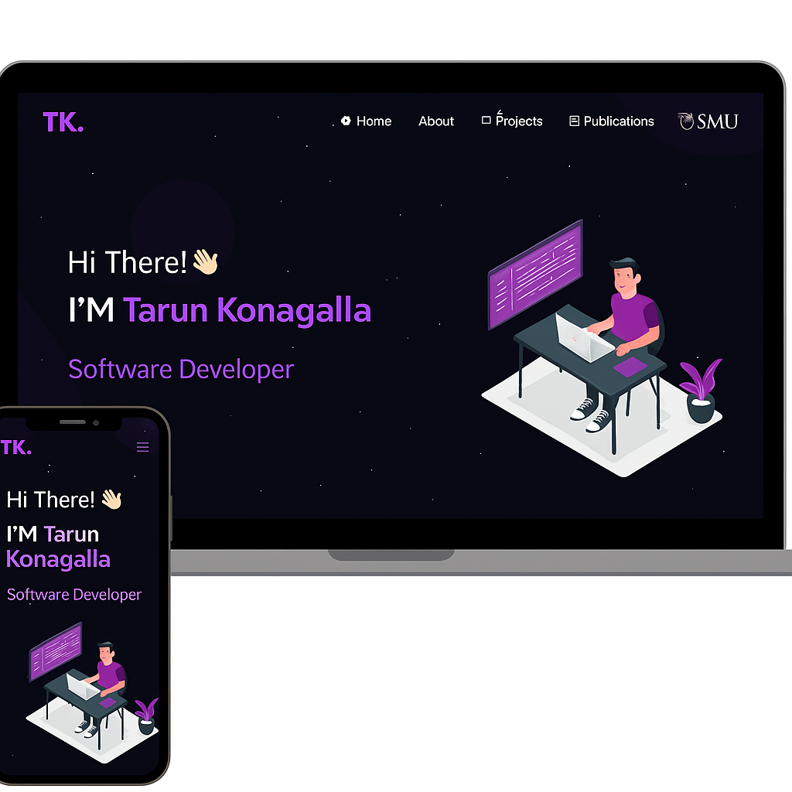

<h2 align="center">
  Tarun Konagalla Portfolio Website - v2.0<br/>
  <a href="https://your-live-portfolio-link.com" target="_blank">tarunkonagalla.dev</a>
</h2>

<div align="center">
  
</div>

<br/>

<div align="center">

[](https://forthebadge.com) &nbsp;
[](https://forthebadge.com) &nbsp;
[](https://forthebadge.com) &nbsp;
 &nbsp;


</div>

<h3 align="center">
    🔹
    <a href="https://github.com/Tarun1928/V2/issues">Report Bug</a> &nbsp; &nbsp;
    🔹
    <a href="https://github.com/Tarun1928/V2/issues">Request Feature</a>
</h3>

---

## 🔥 About

This is my personal portfolio website built using modern frontend tools. It features my latest **projects**, **skills**, and **resume**, and it's designed to highlight my interests in **full stack development**, **cloud computing**, and **AI/ML**.

---

## 🚀 Built With

- React.js
- Bootstrap & CSS
- Node.js (for backend projects)
- Firebase / Vercel (for hosting)
- Visual Studio Code

---

## ✨ Features

- 📖 Multi-page layout
- 🎨 Styled with React-Bootstrap and custom CSS
- 🌐 Fully responsive
- 📂 Project cards with GitHub/demo links
- 📄 Resume section
- ⚙️ Animated sections (Typing, Particle)

---

## 🛠 Getting Started

Clone this repo and make it your own!

```bash
git clone https://github.com/Tarun1928/V2.git
cd V2
npm install
npm start
